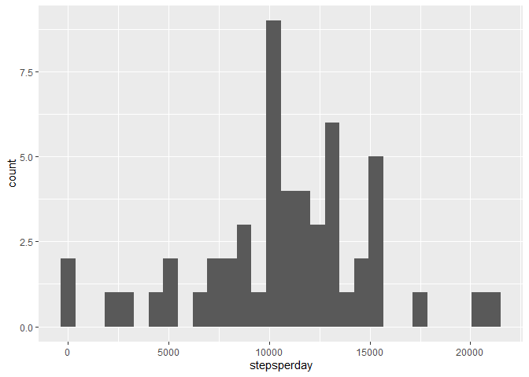
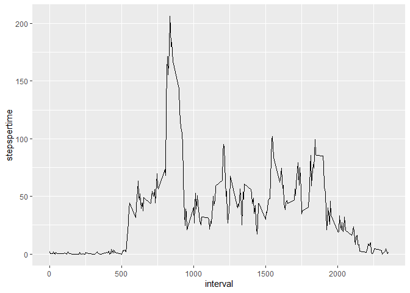
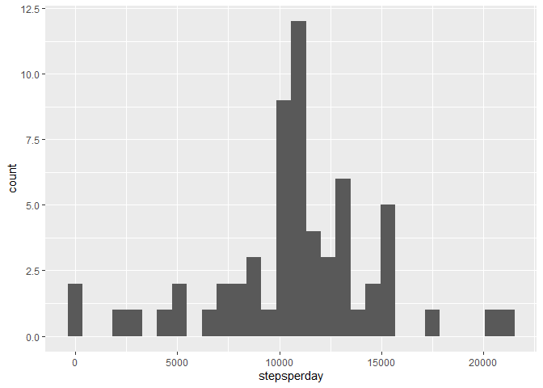
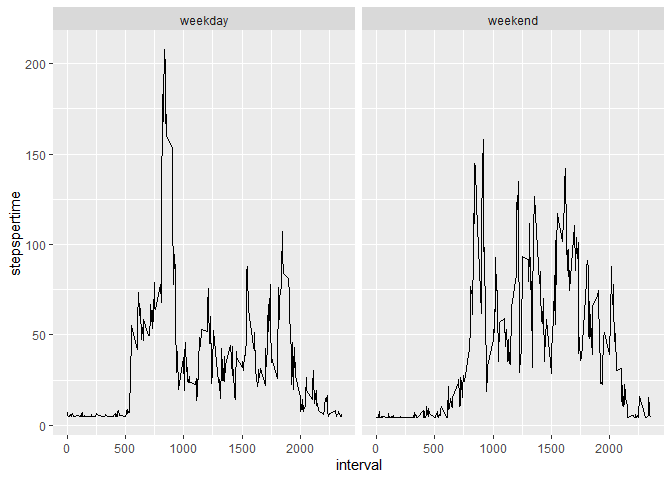

## Loading and preprocessing the data

```r
library(dplyr)
```

```
## 
## Attaching package: 'dplyr'
```

```
## The following objects are masked from 'package:stats':
## 
##     filter, lag
```

```
## The following objects are masked from 'package:base':
## 
##     intersect, setdiff, setequal, union
```

```r
library(ggplot2)
```

```
## Warning: package 'ggplot2' was built under R version 4.0.5
```

```r
library(data.table)
```

```
## 
## Attaching package: 'data.table'
```

```
## The following objects are masked from 'package:dplyr':
## 
##     between, first, last
```

```r
activity<-data.table::fread("./activity.csv")

spd<- aggregate(activity$steps, 
                list(activity$date),
                FUN=sum)

colnames(spd)<- c("date","stepsperday")
```


## What is mean total number of steps taken per day?


```r
h <- ggplot(spd, aes(stepsperday))
h+geom_histogram()
```

```
## `stat_bin()` using `bins = 30`. Pick better value with `binwidth`.
```

```
## Warning: Removed 8 rows containing non-finite values (stat_bin).
```

<!-- -->

```r
#mode
cat(paste("\nmean is : ", mean(spd$stepsperday, na.rm = TRUE)))
```

```
## 
## mean is :  10766.1886792453
```

```r
#median
cat(paste("\nmedian is : ", median(spd$stepsperday, na.rm = TRUE)))
```

```
## 
## median is :  10765
```

## What is the average daily activity pattern?


```r
spt<- aggregate(steps~interval,
               data=activity,
               FUN=mean,
               na.acton=na.omit)

colnames(spt)<- c("interval","stepspertime")

t <- ggplot(spt, aes(interval, stepspertime))
t+geom_line()
```

<!-- -->

```r
spt %>%
select(interval, stepspertime) %>%
filter(stepspertime==max(spt$stepspertime))
```

```
##   interval stepspertime
## 1      835     206.1698
```

## Imputing missing values


```r
print(paste("total NA is : ", activity[is.na(steps), .N ]))
```

```
## [1] "total NA is :  2304"
```

```r
activity[is.na(steps),"steps"]<-activity[,c(lapply(.SD, mean, na.rm = TRUE,)), .SDcols = c("steps")]
```

```
## Warning in `[<-.data.table`(`*tmp*`, is.na(steps), "steps", value =
## structure(list(: 37.382600 (type 'double') at RHS position 1 truncated
## (precision lost) when assigning to type 'integer' (column 1 named 'steps')
```

```r
#data.table::fwrite(activity,"./activity-fillna-median.csv")

fillactivity<-copy(activity)

tspd<- aggregate(activity$steps, 
                list(activity$date),
                FUN=sum)

colnames(tspd)<- c("date","stepsperday")

th <- ggplot(tspd, aes(stepsperday))
th+geom_histogram()
```

```
## `stat_bin()` using `bins = 30`. Pick better value with `binwidth`.
```

<!-- -->

```r
cat(paste("\nmean is : ", mean(tspd$stepsperday)))
```

```
## 
## mean is :  10751.737704918
```

```r
cat(paste("\nmedian is : ", median(tspd$stepsperday)))
```

```
## 
## median is :  10656
```

## Are there differences in activity patterns between weekdays and weekends?


```r
fillactivity$wkday<-weekdays(fillactivity$date)

fillactivity$wkORwkend<-ifelse(fillactivity$wkday=="Saturday"|fillactivity$wkday=="Sunday","weekend","weekday")

fspt<- aggregate(steps~interval+wkORwkend,
               data=fillactivity,
               FUN=mean)

colnames(fspt)<- c("interval","wkORwkend","stepspertime")

ft <- ggplot(fspt, aes(interval, stepspertime))
ft+geom_line()+facet_wrap(wkORwkend ~ .)
```

<!-- -->
